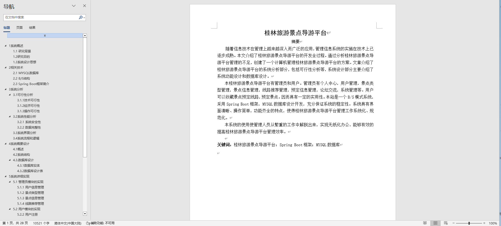
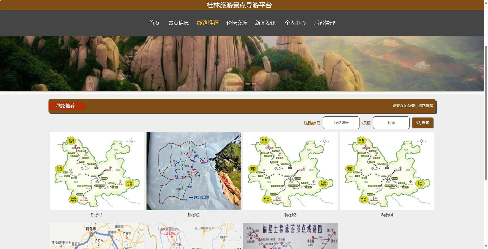
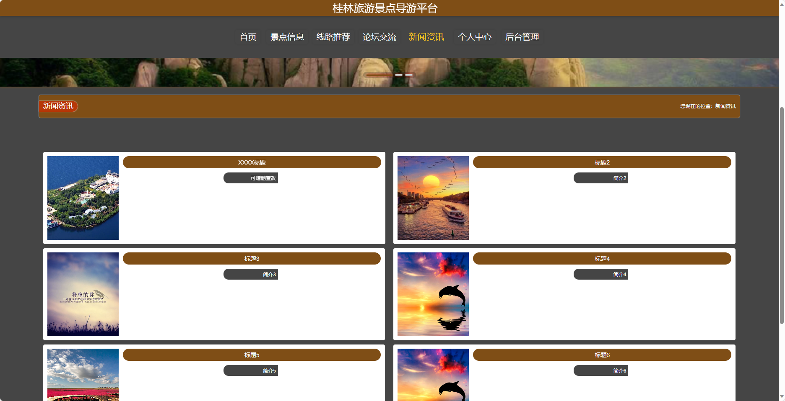
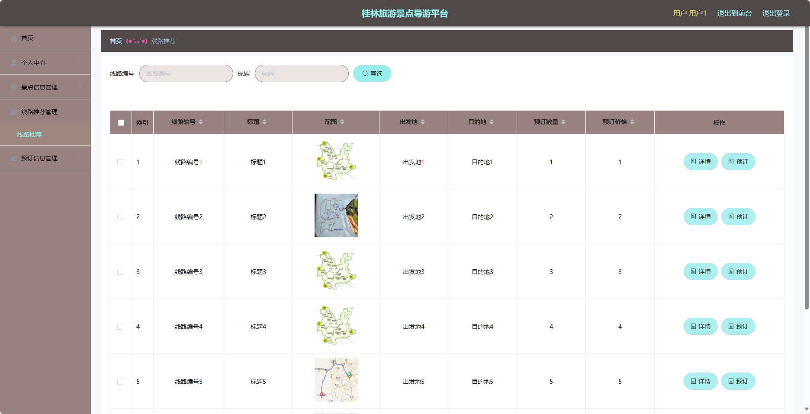
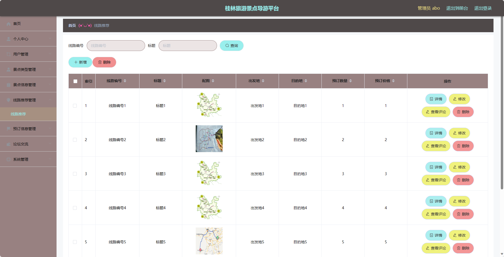

## 基于SpringBoot的桂林旅游景点导游平台(程序+报告)

###  获取sql数据库文件: 从戎源码网 (https://armycodes.com/) QQ: 386869957 QQ群: 377586148
###  所有系统地址: (https://github.com/YuLin-Coder/AllProjectCatalog) 
###  所有项目以及源代码本人均调试运行无问题 可支持远程安装部署调试、定制修改、代码讲解

## 项目介绍
基于SpringBoot的桂林旅游景点导游平台，系统包含两种角色：管理员、用户,系统分为前台和后台两大模块，主要功能如下。

### 【管理员】:
1. 个人中心：管理员可以管理自己的个人信息和权限。
2. 用户管理：对用户信息进行管理，包括添加、修改和删除用户信息。
3. 景点类型管理：管理景点的类型，包括添加、修改和删除景点类型。
4. 景点信息管理：管理景点的详细信息，包括添加、修改和删除景点信息。
5. 线路推荐管理：管理线路推荐的信息，包括添加、修改和删除线路推荐。
6. 预订信息管理：管理用户的预订信息，包括查看和处理预订请求。
7. 论坛交流：管理员可以管理论坛交流区，包括审核和删除帖子。
8. 系统管理：管理系统的参数设置和日志记录。

### 【前台】:
1. 首页：展示导游平台的基本信息和推荐景点、线路等内容。
2. 景点信息：提供各个景点的详细信息，包括景点介绍、地址、交通方式等。
3. 线路推荐：推荐游览桂林的线路，包括线路介绍、景点安排、费用等。
4. 论坛交流：提供用户之间的交流平台，可以分享旅游经验、提问问题等。
5. 新闻资讯：发布最新的旅游资讯和桂林相关新闻。
6. 个人中心：用户可以查看和编辑个人信息，包括个人资料、订单记录等。

### 【用户】:
1. 个人中心：用户可以查看和编辑个人信息。
2. 景点信息管理：用户可以查看各个景点的详细信息。
3. 线路推荐管理：用户可以查看推荐的线路信息。
4. 预订信息管理：用户可以查看已预订的线路信息和处理预订请求。

## 项目技术
- 编程语言：Java
- 数据库：MySQL
- 项目管理工具：Maven
- 前端技术：HTML、CSS、JavaScript、Jquery、Vue
- 后端技术：Spring、SpringMVC、MyBatis

## 运行环境
- JDK版本：JDK1.8及以上
- 开发工具：IDEA、Ecplise、Myecplise都可以
- 数据库: MySQL5.7及以上
- Maven：maven3.0及以上
- Node：14.14.0及以上

## 运行截图

